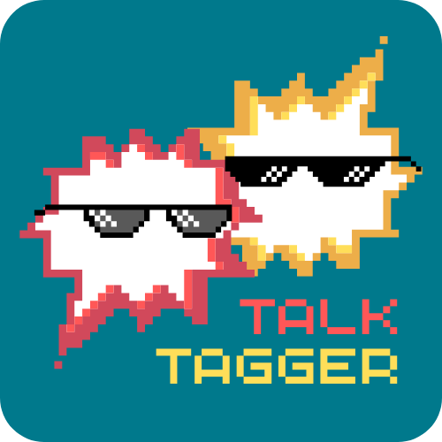

# <div align="center">TalkTagger</div>

<div align="center">
  <p>
    <a href="#quick-start">Quick Start</a> •
    <a href="#how-to-play">How to Play</a> •
    <a href="#technical-details">Technical Details</a> •
    <a href="#game-features">Game Features</a> •
    <a href="#development">Development</a> •
    <a href="#license">License</a>
  </p>

  <a href="https://docs.mistral.ai/getting-started/models/models_overview/">
    
  </a>
  <a href="mailto:nilatabey@gmail.com">
    
  </a>
</div>

---

<div align="center">
  
</div>

<div align="center">

📄 <a href="talktagger_project_report.pdf"><strong>Read the Project Report</strong></a><br>
🖥️ <a href="talktagger_presentation.pdf"><strong>View the Presentation Slides</strong></a>

</div>

# TalkTagger

**Can you guess who said that?** Upload your group chat history and turn it into an exciting guessing game!

## Quick Start

1. **Replace the Mistral AI API key in** `backend/message_generator.py`

2. **Install dependencies:**
   ```bash
   pip install -r requirements.txt
   ```

3. **Run the server:**
   ```bash
   python frontend/app.py
   ```

4. **Open your browser:**
   - Go to `http://localhost:5000`
   - Or use your PC's IP address to connect from phones

## How to Play

### For Hosts (Game Creators):

1. **Click "Create Game"** on the homepage
2. **Select your chat platform:**
   - **Discord:** Export your server/channel as TXT
   - **WhatsApp:** Export your chat as a TXT file
3. **Upload your chat files:**
   - Drag and drop files or click to select
   - Supports single files or ZIP archives
4. **Click "Upload & Process"**
   - The system will automatically process your chat data
   - Watch the progress bar as it analyzes your conversations
5. **Click "Create Game"** once processing is complete
6. **Share the game code** with your friends
7. **Start the game** when everyone has joined

### For Players:

1. **Enter your username** and the **game code** from the host
2. **Click "Join Game"**
3. **Wait for the host to start** the game
4. **Guess who sent each message!**

**Score Explanations:**

- **Distinctiveness Score:** This score indicates how closely a message aligns with a player's unique texting style, based on factors such as word choice, punctuation, and message length. Higher scores mean the message is more typical for that player. There's no fixed maximum—the score increases as more of the player's signature habits appear in the message.

- **BERT Similarity Score:** This score utilizes measures the similarity between a message and a player's actual messages, taking into account both meaning and style. It's shown as a percentage from 0% to 100%, where higher values mean the message is more similar to that player's usual way of texting.

## File Upload Requirements

### Discord Exports:
- Export your Discord direct messages/server channel as TXT using external tools
- Upload the TXT file(s)

### WhatsApp Exports:
- Go to Settings > Chats > Export Chat
- Export your WhatsApp chat as ZIP file
- Extract it and upload the TXT file

## Technical Details

The system automatically runs a complete pipeline when you upload files:

1. **File Parsing:** Converts Discord/WhatsApp exports to structured data
2. **Data Preprocessing:** Analyzes user profiles and message patterns
3. **Game Data Creation:** Selects the most distinctive messages for the game
   - To prevent easy guessing, any messages that mention usernames or parts of usernames of participants are filtered out during message selection and AI generation. This is especially important for small group chats or DMs, where name mentions can make attribution trivial.
4. **Synthetic Message Generation:** Creates AI-generated messages in each user's style
5. **Sentiment Analysis:** Adds emotional context to messages
6. **Game Integration:** Loads processed data into the game engine

## Game Features

- **Real Messages:** Guess who sent actual messages from your chat
- **Synthetic Messages:** Challenge yourself with AI-generated messages
- **Scoring System:** Points based on message distinctiveness and difficulty
- **Real-time Multiplayer:** Play with friends simultaneously
- **Leaderboards:** Track scores and see who's the best guesser

## Development

### Running the Pipeline Manually:
If you want to run the data processing pipeline separately:
```bash
python final.py
```

## Troubleshooting

- **Upload fails:** Make sure your files are in the correct format (TXT)
- **Processing errors:** Check the console output for detailed error messages
- **Connection issues:** Verify the server IP address and port in the browser console
- For other issues, you can open a new issue on this repository or contact me at nilatabey@gmail.com

## Acknowledgments

This project was developed as part of the **AI Lab: Computer Vision and NLP** course taught by Prof. Daniele Pannone for the **Applied Computer Science and Artificial Intelligence** BSc program at **Sapienza University of Rome**.  
I’m sharing all of this material as a reference for future students and anyone interested in building similar NLP-based interactive applications.


## License

This project is licensed under the [MIT License](LICENSE).  
It is shared for educational and entertainment purposes. Feel free to use, modify, and build upon it with proper attribution.
